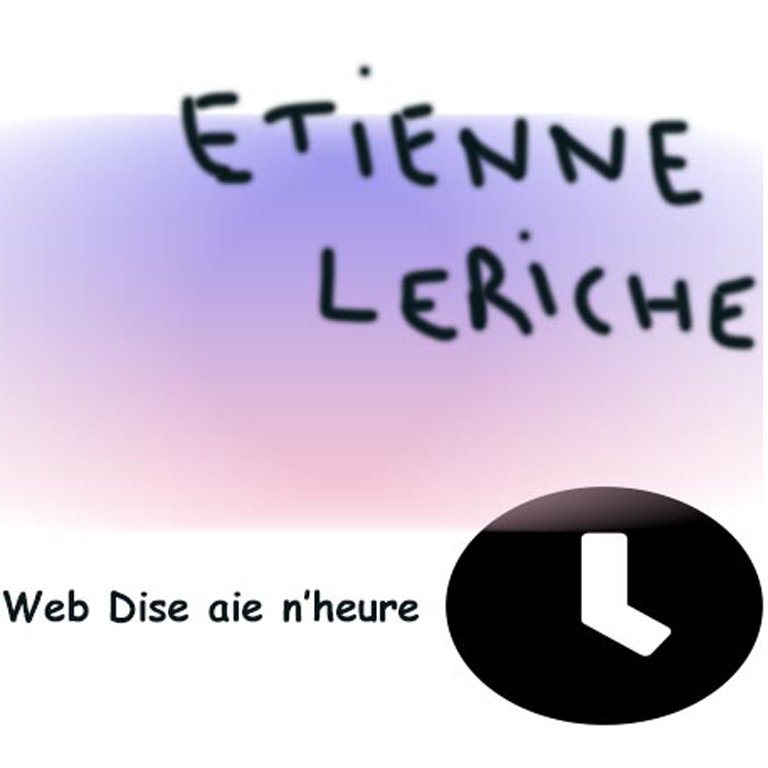

# Poisson d'avril 2024 : « Nouvo sith web® »

Le site d'une fausse agence web, volontairement raté de bout en bout : fautes assumées, Comic Neue, boutons qui fuient et bouton « Contact » qui affiche le code source de la page.



**Démo : [el-cassegrain.github.io/poisson-avril-2024](https://el-cassegrain.github.io/poisson-avril-2024/)**


## Contexte

Poisson d'avril 2024. Pour un designer, réussir un site moche demande autant d'intention qu'en réussir un beau : chaque « erreur » est choisie.

## Fonctionnalités

- « Contact » ouvre une modale qui affiche le code source HTML de la page
- Le bouton de fermeture se dérobe au premier clic et ne ferme qu'au second
- Le bouton « Menu » s'attrape et se déplace à la souris
- Le lien « professionnels » ouvre une alerte « PRO-FESS-YO-NEL »

## Installation

C'est un site statique, sans étape de build. La version publiée sur GitHub Pages est celle du dossier `docs/`.

```bash
git clone https://github.com/El-Cassegrain/poisson-avril-2024.git
cd poisson-avril-2024
pnpm dlx serve docs
```

---

Réalisé par [Etienne Leriche](https://etienneleriche.com), designer UI/UX et développeur front-end.
